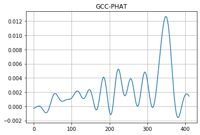

Facing The Music
==============================

## Binaural Sound Source Localisation Using Machine Learning

This repository serves to document my undergraduate thesis for a BscEng in Electrical & Computer Engineering at the University of Cape Town. 
The goal of this project was to develop a binaural sound source localisation
system using machine learning. This was undertaken as a proof of concept for an auditory perception system in a search and rescue robot. 

The following research question was proposed: 

* In comparison to using classical signal processing techniques, can deep learning
  be used in the task of binaural sound source localisation in order to
  develop a system that is robust to noise and reverberation? 
  
* Furthermore, can the deployment of this system on a rotating robotic platform improve localisation accuracy?


The final deliverable of this project was a robotic system that was capable of locating a sound source and rotating to face it. All the models were run in real time on a Raspberry Pi 3 B+. 

Comprehensive documentation for this project can be found in my undergraduate 

Video Demo
---------------

<p align="center">
  
</p>

A full video demo of the project can be viewed [here](https://youtu.be/xl86-_YQZdM?t=185)
 

About
--------------

The following sections serve to provide a brief overview of the design process
of the project as well as an introduction to the code base used.

#### Overview 

* A data synthesis methodology was designed and implemented. This method was used to generate large synthetic datasets for use    in machine learning. 
* Classical signal processing techniques were used to act as a comparative
  baseline for the machine learning techniques utilized herein.
* Three deep learning models were designed, trained and evaluated. 
* A rotation algorithm was devised in which predictions were updated with each movement, allowing 360 ◦ localisation to take
  place. 
* The full localisation model was tested in simulation and then deployed in a
  real world environment.
* The system was thoroughly evaluated in a number of real world scenarios


### Data

To train a network for binaural sound source localisation, a dataset of stereo audio recordings with direction of arrival labels was required. Unfortunately to the best of my knowledge no such dataset exists. There are a number of datasets that utilize a dummy head such as the [KEMAR](https://www.gras.dk/products/head-torso-simulators-kemar/product/733-45bb), but these are intentionally recorded to represent the acoustic properties of the human torso and head. Furthermore, the existing datasets were reletively small (< 500 data points), and thus in order to train deep NNs effectively, a larger dataset was required. 

To navigate this obstacle, a large dataset of labelled, stereo wav files were synthesized using the [Image Source Method](https://jontalle.web.engr.illinois.edu/uploads/537/Papers/Public/Allen/AllenBerkley79.pdf). The implementation of this method was provided by the excellent [pyroomacoustics](https://pyroomacoustics.readthedocs.io/en/pypi-release/), a python package for room acoustics simulation.

I wrote a class that creates an artificial room and binaural microphone configuration. A mono audio recording from the Google Speech Commands dataset is then placed in the room in a specified position, arriving at the microphones with a specified direction of arrival. A stereo waveform is then generated with the spatial information imparted on the original mono recording. Thus with the setero file, the direction of arrival of the sound can be easily percieved. An audio demo of this is included in the [explanatory notebook](./src/notebooks/).

The code to synthesize a single data point is shown below: 

In this instance we have:
  - 4x4x4 meter room
  - reflection order of 17
  - microphone height of 2m
  - microphone centre of (x=2,y=2)
  - inter microphone distance of 0.2m 
  - a source azimuth of 70 degrees
  - an SNR of 0
  - an RT60 of 1 second (this corresponds to the reverb time of the room)

```
# Select an arbitrary data point from the Google Speech Commands dataset
source = data_generator_lib.get_data(1)[5] 

# Set up constant parameters for the room
room = Binaural(room_dim=np.r_[4., 4., 4.],
             max_order=17,
             speed_of_sound=343,
             inter_aural_distance=0.2,
             mic_height=2)

# Synthesize a stereo wav file with a direction of arrival of 70 degrees
room.generate_impulse_pair(source_azimuth_degrees=70,
                           source_distance_from_room_centre=1,
                           SNR=0,
                           RT60=1,
                           mic_centre=np.array([2, 2]),
                           mic_rotation_degrees=0,
                           fs=source.fs,
                           source_signal=source.data,
                           plot_room=True,
                           plot_impulse=False,
                           write_wav=True,
                           wav_name="demo_stereo_wav")
```

This code will generate a plot of the room configuration shown below. The yellow
dot is the mono audio source and the red dots are the microphones. The triangle
serves to represent the front of the microphone configuration (googly eyes).
<p align="center">
  
</p>


This data synthesis system allows for a number of degrees of freedom in
synthesizing a dataset. The final dataset used for training had over 300 000
data points varying in: 
- room size
- microphone position 
- source position
- mono audio source 
- signal to noise ratio
- reverb time

Some example room configurations are shown below: 

Direction of Arrival: 350 degrees           |  Direction of Arrival: 120 degrees
:-------------------------:|:-------------------------:
  |  

Synthesising such a large dataset is very computationally expensive. A parallel
implementation of the above code was created using python multiprocessing. This
was run on a GCP instance with 12 cores and 60GB of RAM. The script used to run
the data synthesis can be viewed [here](./src/data/generate_data.py). To
synthesize a dataset of any size, configure the degrees of freedom in
`generate_data.py` and then run the script. For example:

``` python
# Configure degrees of freedom in dataset synthesis
source_azimuth_list = np.arange(0, 360, 5)
RT60_list =  [0.3, 0.5, 0.7]
SNR_list = [-20]
source_distance_from_room_centre_list =  [0.5, 1, 1.5]
mic_rotation_list =  [45, 135, 225, 315]
mic_centre_list = [np.array([1.5, 1.5]),
                   np.array([0.5, 0.5]),
                   np.array([2.5, 0.5]),
                   np.array([0.5, 2.5]),
                   np.array([2.5, 2.5])]

```

and then run: 

``` shell
python generate_data.py
```


### Front Back Labelling and the Cone of Confusion

#### Cone of Confusion

An interesting problem encountered in the case of a binaural microphone
configuration is the inherent ambiguity between the front and the back of the
listener. The time domain information received at each microphone does not allow
us to distinguish between a sound arriving from 70 degrees and -70 degrees as
illustrated below: 

<p align="center">
  
</p>


To illustrate this, consider the following two room configurations: 

Direction of Arrival: 45 degrees           |  Direction of Arrival: 315 degrees
:-------------------------:|:-------------------------:
  |  


The direction of arrival can be computed by estimating
the time delay between each channel of the recorded signal. We can do this by
finding the peak of the cross correlation between the two signals. The cross
correlation technique used is the generalised cross-correlation with phase
transform. This is a cross correlation with a weighting function as proposed by ...

GCC-PHAT: 45 degrees           |  GCC-PHAT 315 degrees
:-------------------------:|:-------------------------:
  |  

It is evident from the graphs that the peaks occur at the same sample delay for
the two different directions of arrival. Thus when estimating the direction of
arrival from the cross correlation peaks, both result in 45 degrees. The
implementation of this computation can be viewed
[here](./src/models/gccphat.py). 


This is an effect that is experienced to some degree in the human auditory
system and is often referred to as the "cone of confusion". We have developed a number
of novel ways of dealing with this issue, one of which being subtle head
movements that aid in the process of localisation. Taking inspiration from this
biological phenomenon, this system utilizes a rotation algorithm in conjunction
with a series of predictions to mitigate front back ambiguity. 

#### Front Back Labelling

For the purpose of training networks, during data synthesis each direction of arrival was labelled
with the two possible directions that could arise as a result of the
front-back confusions. For example, a data point that has a direction of arrival
of 45 degrees would be labelled as 45 degrees and 315 degrees. This labelling
technique in conjunction with a rotation algorithm and successive
predictions allows for a probability for each possible direction to be
determined. Thus the direction with the highest probability is determined as the
true direction of arrival.

After data synthesis the file names and their associated directions of arrival
are stored in a file called `data_labels.csv`.

## Rotations

An activity diagram of the rotation algorithm is shown below. This illustrates
how successive predictions can be used to determine which of the two possible
directions the source is emanating from. 

<p align="center">
  
</p>

Using the deep learning model described in the following section, this 
gif shows a simulation of this rotation model in action. A data point with a
true direction of arrival of 70 degrees is synthesised and fed into the model.
Pairs of successive predictions are then plotted until the final prediction is
determined. In this instance, the model correctly predicts the direction of arrival.

<p align="center">
  
</p>


## Models

Multiple models were prototyped and tested. The best performing model was CNN that used the
generalised cross-correlation between the two audio channels as the input
feature representation. This data preprocessing pipeline is shown below.

<p align="center">
   
</p>

The following block diagram describes the direction of arrival estimation
pipeline in full:

<p align="center">
  
</p>

The deep learning model used the following architecture

<p align="center">
  
</p>

The GCC-PHAT method of estimating DOA from time delay was used as a comparative
baseline when evaluating the deep learning models.


## Hardware


The rotation algorithm and the various models were implemented on a Raspberry Pi
3 B+. Two microphones and a stepper motor were housed in a 3D printed case, the
design of which is shown in the image below: 
<p align="center">
    
</p>


This housing is connected to the raspberry pi via a ribbon cable. An Apogee Duet
audio interface was used to record audio from the microphones. Detailed
instructions to replicate this hardware, including schematics, are included in
my thesis document.

Hardware Integration |  Microphones and stepper motor in housing | Full System |
:-------------------------:|:-------------------------:|:-------------------------:|
  |  |  |


### Findings

* Experimentation showed that even though a useful model of binaural sound
  source localisation was developed, its performance with respect to noise and reverberation
rejection did not show a significant improvement upon the existing signal processing
method. 

* This being said, the deep learning model was successfully deployed on a hardware
system and was able to perform direction of arrival estimation with promising accuracy
in a controlled environment. 

* One of the most promising findings was that the system, which was trained entirely on synthesized data, was capable of    performing robust localisation in real environments when deployed on the hardware. 

This work presents a starting point for further research in pursuit of a robust, end-to-end, data-driven solution to binaural sound source localisation.


Getting Started
--------------------

If you wish to explore the work of this project, have a look throught the jupyter notebook Facing the Music. This notebook
walks through the logic of the system through the following steps:

* Data Synthesis
* Data Preprocessing
* Simulation

If you would like to play around and explore the code and simulations, you can run the jupyter notebook on your own 
machine as follows. 

```
git clone https://github.com/murning/facing-the-music && cd facing-the-music
conda env create -n facing-the-music -f=facing-the-music.yml
conda activate facing-the-music
jupyter notebook ./src/notebooks/Facing\ The\ Music.ipynb
```

Note that synthesizing the dataset is rather computationally expensive. If you plan to synthesize a dataset of 50000+ points you will need a lot of ram and as many cores as you can get your hands on. I used a GCP instance with 12 cores and 60gb of ram.

If you wish to explore the hardware design, please see the *Design* chapter in my 


